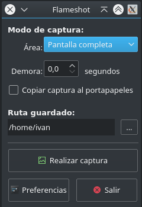

#Lanzador para el capturador de pantalla Flameshot

Flameshot es un magnífico capturador de pantalla pensado para ser ejecutado desde la línea de comandos (al menos a finales de 2017). Éste es un pequeño lanzador en que se puede seleccionar mediante un diálogo Qt5 el tipo de área a capturar, el tiempo de demora, la opción de copiar la captura al portapapeles y la ruta de guardado. También se icluye un pequeño script para crear el correspondiente .desktop en /usr/share/applications

Este proyecto, puesto que fue prácticamente mi primera toma de contacto con Python, se hizo a modo de experimento, así que no pretende otra cosa que la de iniciarse y experimentar con Python3 y Qt5.

